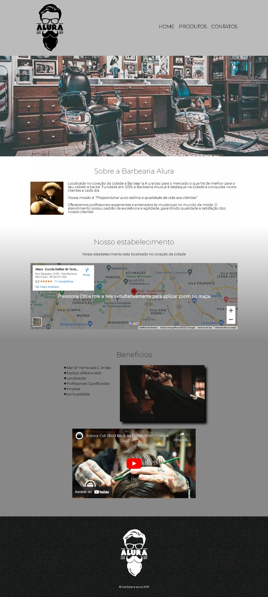
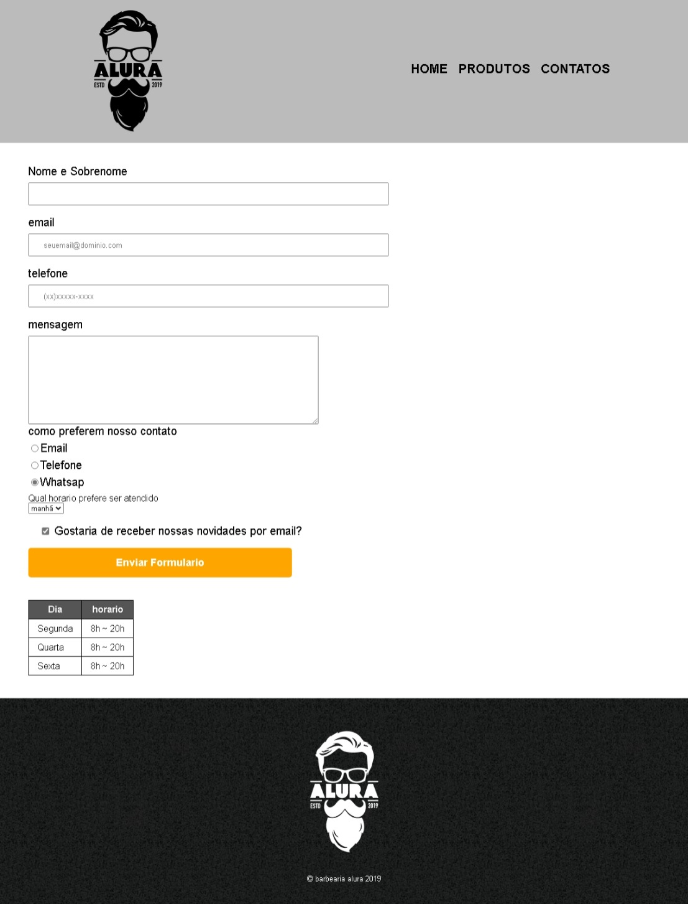
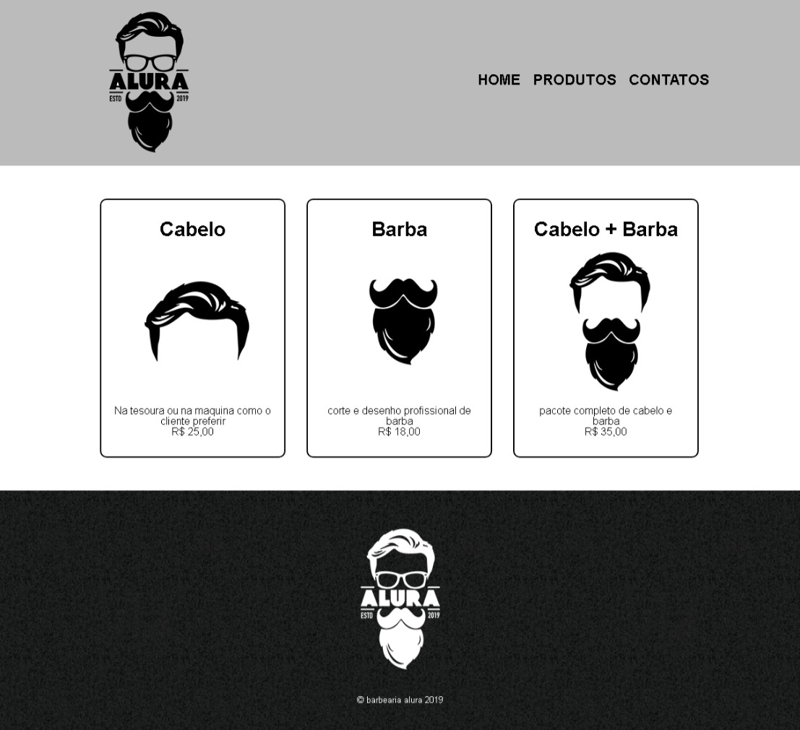

<h1 align = "center"> 💈 Barbearia Alura 💈</h1>

 Projeto desenvolvido na formaçao de html/css da Alura, para ensino de tecnologias web

<a href = "#tecnologias">Tecnologias</a>&nbsp;&nbsp;&nbsp;|&nbsp;&nbsp;&nbsp;
<a href = "#projeto">Projeto</a>&nbsp;&nbsp;|&nbsp;&nbsp;&nbsp;
<a href = "#layout">Layout</a>

<h1>📱Tecnologias</h1>
    Esse projeto foi desenvolvido cm as tecnologias:
    <ul>
    <li>HTML e CSS</li>
    </ul>
    <h1>📜 Projeto</h1>
    
  A barbearia Alura é um projeto feito para estudar as funções e conhecer mais a fundo Html e css
    <h1> 📄Layout </h1>

<h3> Pagina principal</h3>

<h3> contatos</h3>

<h3> Produtos</h3>

